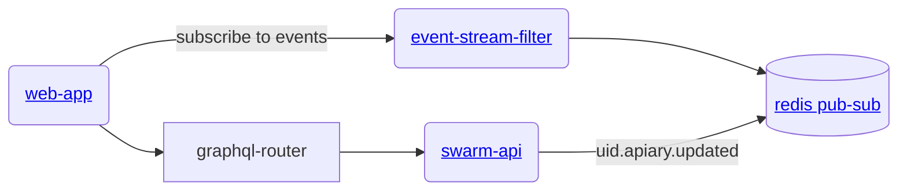

# gratheon / event-stream-filter
A service that streams backend events to the frontend over websocket protocol using GraphQL notation and filtering based on graphql subscriptions.


## Architecture



## URLs
graphiql locally - http://localhost:8300

## Usage
Install:
```sh
nvm use
npm install
```

Run natively:
```sh
npm run start
```

Run with docker:
```sh
make start
```
